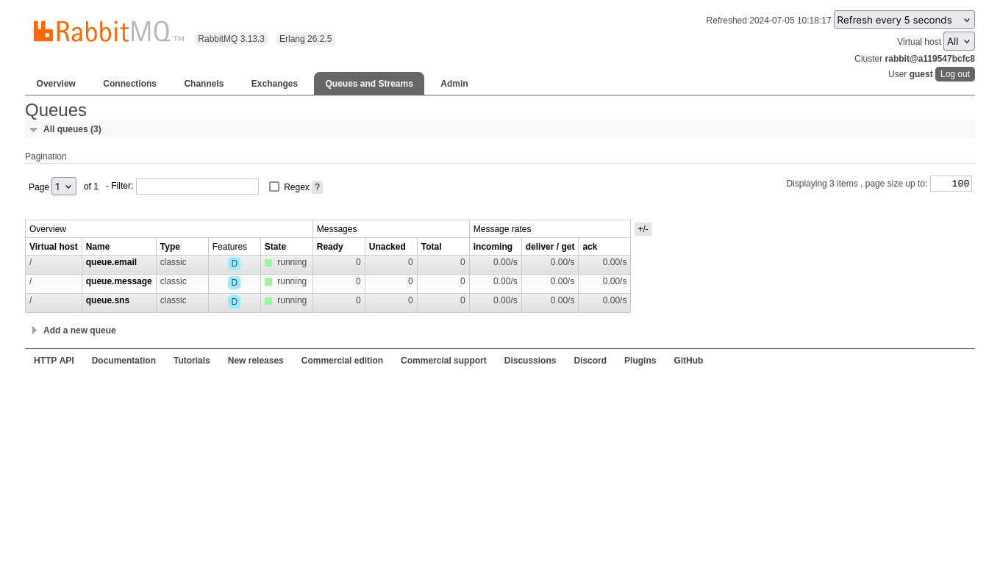

**## Take-home Microservices Challenge
This is how we faced the challenge of creating some microservices
to consume notifications services.**
## _Table of contents_

- [_Overview_](#overview)
- [_Requirements_](#requirements)
- [_Screenshot_](#screenshot)
- [_Links_](#links)
- [_Built with_](#built-with)
- [_How I did it_](#how-i-did-it)
- [_Continued development_](#continued-development)
- [_Useful resources_](#useful-resources)
- [_Author_](#author)
- [Acknowledgments](#acknowledgments)

## _Overview_
This notification app has been coded using Spring Boot, Spring JPA, Spring AWS SDK, Spring RabbitMQ,MapStruct, Jackson,
Lombok, OpenAPI, H2 DB.
- src
    - main
    - java
      - com/xxx/challenge/notification
        - config
        - controller
        - dto
        - entity
          - enums
        - mapper
        - payload
        - repository
        - services
          - exceptions 
    - resources
      - db.migration
    - test 
-

_Requirements_
  ```
  - rabbitMQ running at 127.0.0.1:5672 socket
  - H2 database classpath:data/notification
  - profile active: dev
  - service socket: 127.0.0.1:8095

```

## _Screenshot_
[]()
## _Links_
- Live Site URL: [http://127.0.0.1:8095/swagger-ui/index.html] 
## _Built with_

[](https://skillicons.dev)


 ## _How I did it_
```java
package com.gila.challenge.notification.entity.enums;

public enum MessageStatus {
  
  DELIVERED_SMS(1),
  DELIVERED_EMAIL(2),
  READY_TO_DELIVER(3),
  WAITING_EXCHANGE(4);

  private final int codeStatus;

  private MessageStatus(int codeStatus) {
    this.codeStatus = codeStatus;
  }

  public int getCodeStatus() {
    return codeStatus;
  }

  public static MessageStatus valueOf(int codeStatus) {
    for (MessageStatus value : MessageStatus.values()) {
      if (value.getCodeStatus() == codeStatus) {
        return value;
      }
    }

    throw new IllegalArgumentException("Invalid MessageStatus code");
  }
}
``` 

## _Continued development_
- Unit Tests
- Provide a Json to FrontEnd including
  - delivery status of each message to frontend
  - count of messages consumed by subscriber
- Subscriber Authentication
  - Spring JWT-OAuth2 
- Messages Pagination

### _Useful resources_
- [https://spring.io] Awesome Java framework!.
- [https://start.spring.io/]  Handy startup tool.
- [https://mvnrepository.com] Tools that help tackle the beast
## _Author_
- Website - [https://ferreiras.dev.br]
_Acknowledgments_
- 
