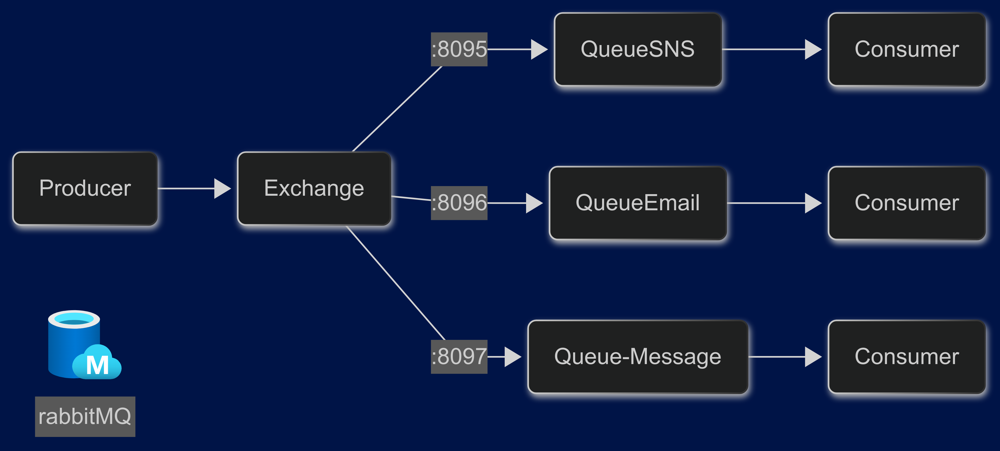

                                                                                                                                         **## Microservices Challenge

This is how we faced the challenge of creating an application that
allows the sending of a message through an Angular-based front-end app,
providing an email and a phone number. The message is published to a RabbitMQ exchange
that fuels the email queue, SMS queue and a message queue with the goal of
how to build such application using Spring Boot, AWS Java SDK, Gmail and explore
how the AMPQ protocol fits these requirements.

## _Table of contents_

- [_Table of contents_](#table-of-contents)
- [_Overview_](#overview)
- [_Screenshot_](#screenshot)
- [_Links_](#links)
- [_Built with_](#built-with)
- [_How I did it_](#how-i-did-it)
- [_Continued development_](#continued-development)
    - [_Useful resources_](#useful-resources)
- [_Author_](#author)
- [_Acknowledgments_](#acknowledgments)

## _Overview_

This notification app has been coded using Spring Boot, Spring JPA, Spring AWS SDK, Spring RabbitMQ, MapStruct, Jackson,
Lombok, OpenAPI, H2 DB.

- src
    - main
    - java
        - com/xxx/challenge/notification
            - config
            - controller
            - dto
            - entity
                - enums
            - mapper
            - payload
            - repository
            - services
                - exceptions
    - resources
        - db.migration
    - test
-

_Requirements_

  ```
  - rabbitMQ container running at 127.0.0.1:5672
  - H2 database classpath:data/notification
  - profile active: dev
  - service socket: 127.0.0.1:8095

```

## _Screenshot_

[]()

## _Links_

- Live Site URL: [http://127.0.0.1:8095/swagger-ui/index.html] 

## _Built with_

[](https://skillicons.dev)

## _How I did it_

```java
package com.challenge.notification.entity.enums;

public enum MessageStatus {

    DELIVERED_SMS(1),
    DELIVERED_EMAIL(2),
    READY_TO_DELIVER(3),
    WAITING_EXCHANGE(4);

    private final int codeStatus;

    private MessageStatus(int codeStatus) {
        this.codeStatus = codeStatus;
    }

    public int getCodeStatus() {
        return codeStatus;
    }

    public static MessageStatus valueOf(int codeStatus) {
        for (MessageStatus value : MessageStatus.values()) {
            if (value.getCodeStatus() == codeStatus) {
                return value;
            }
        }

        throw new IllegalArgumentException("Invalid MessageStatus code");
    }
}
``` 

## _Continued development_

- Unit Tests
- Provide a Json to FrontEnd including
    - delivery status of each message to frontend
    - count of messages consumed by subscriber
- Subscriber Authentication
    - Spring JWT-OAuth2
- Messages Pagination

### _Useful resources_

- [https://spring.io] Awesome Java framework!.
- [https://start.spring.io/]  Handy startup tool.
- [https://mvnrepository.com] Tools that help tackle the beast

## _Author_

- Website - [https://ferreiras.dev.br]
  _Acknowledgments_
- 
